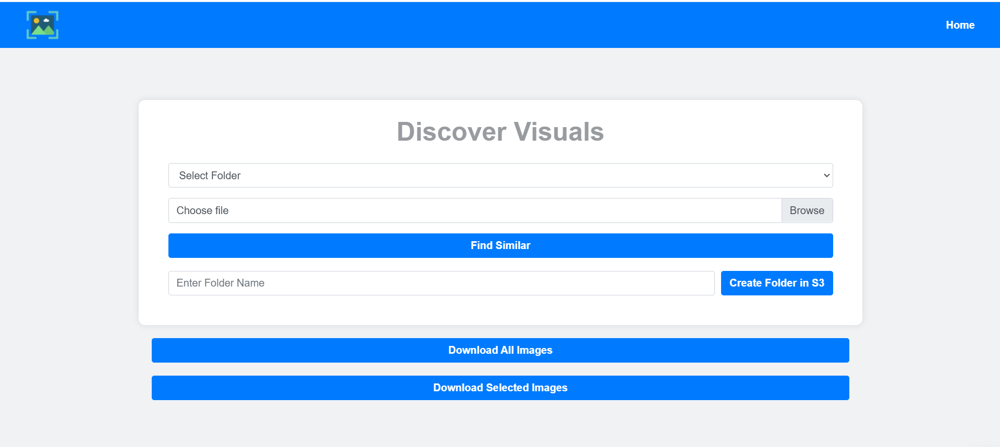

# VisionVault - Image Retrieval & Management System

**VisionVault** is a web-based image management application built with Flask and AWS services (S3, Rekognition). It allows users to upload, manage, and retrieve images from an S3 bucket efficiently, leveraging AWS Rekognition to compare image similarities based on facial recognition. This platform accelerates image search and download processes by using smart algorithms, saving time and providing a seamless experience for users.

  <!-- Add your screenshot here -->

## Features

- **Image Upload to S3**: Upload images to specific folders within an AWS S3 bucket.
- **Folder Management**: Create new folders within the S3 bucket and upload content to them.
- **Face Comparison**: Use AWS Rekognition to compare faces in images and find similar images based on facial features.
- **Image Download**: Select multiple images and download them as a zip file.
- **Search and Filter**: Select a folder from the list and search for similar images using the upload feature.
- **Easy-to-use Interface**: The web interface is simple, allowing users to interact with the app efficiently.
  
## Installation

1. Clone the repository to your local machine:
   ```bash
   git clone https://github.com/yourusername/VisionVault.git
   ```

2. Navigate to the project folder:
   ```bash
   cd VisionVault
   ```

3. Create and activate a virtual environment:
   ```bash
   python -m venv venv
   source venv/bin/activate  # For Linux/Mac
   .\venv\Scripts\activate   # For Windows
   ```

4. Install the required dependencies:
   ```bash
   pip install -r requirements.txt
   ```

5. Set up your AWS credentials:
   - Make sure your AWS credentials (`AWS_ACCESS_KEY_ID`, `AWS_SECRET_ACCESS_KEY`) are configured correctly, either through environment variables or the AWS CLI.

6. Run the application:
   ```bash
   python app.py
   ```

7. Open the web application in your browser:
   - The app will be running on `http://127.0.0.1:5000`.

## How to Use

1. **Home Page**:
   - Select a folder from the list of available folders in the S3 bucket.
   - You can also create new folders or upload images to existing ones.

2. **Find Similar Images**:
   - Upload an image and the system will search the selected folder for similar images using AWS Rekognition.
   - The app compares faces in the uploaded image with those in the selected folder and returns images with a high similarity score.

3. **Download Images**:
   - Select multiple images and download them as a zip file.

## Technologies Used

- **Flask**: Web framework to build the app.
- **AWS S3**: For storing and managing image files.
- **AWS Rekognition**: For image analysis and face comparison.
- **Boto3**: AWS SDK for Python to interact with AWS services.
- **Matplotlib**: For displaying images in the web app.

## File Structure

```
VisionVault/
│
├── app.py                 # Main Flask application file
├── requirements.txt       # Python dependencies
├── templates/             # HTML templates for the app
│   ├── index.html         # Home page
│   ├── about.html         # About page
├── static/                # Static files like images, CSS
│   └── screenshot.png     # Add your app screenshot here
└── README.md              # Project documentation
```

## Contributing

1. Fork this repository.
2. Create a new branch (`git checkout -b feature-name`).
3. Make your changes and commit them (`git commit -am 'Add feature'`).
4. Push to the branch (`git push origin feature-name`).
5. Open a pull request.

## License

This project is licensed under the MIT License - see the [LICENSE](LICENSE) file for details.

## Acknowledgements

- AWS Rekognition for facial recognition and image analysis.
- Flask for creating the web application.
- Boto3 for interacting with AWS services.
